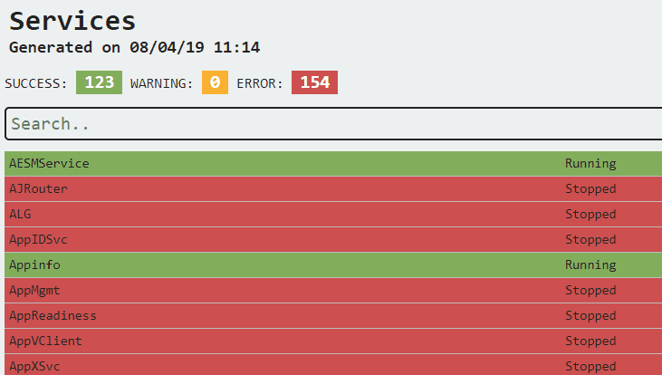
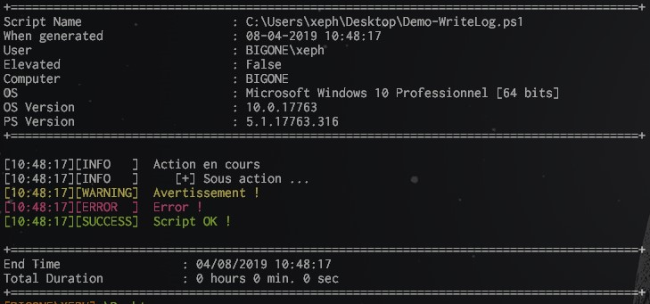
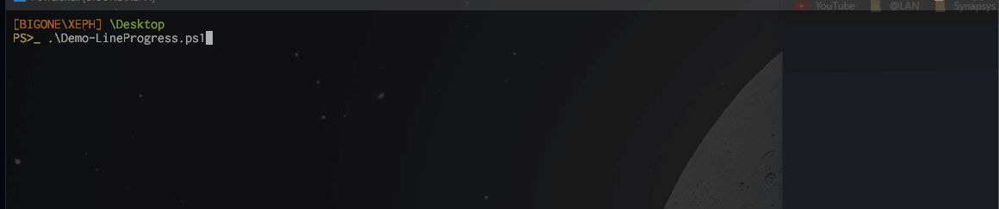

## Présentation

Ma boite à outils Powershell, l'ensemble des functions que j'utilise quotidiennement.

## Installation

```powershell
cd ($env:PSModulePath -split ";")[0]
git clone https://git.reyozam.xyz/Xeph/JMTools.git
```
## Quelques Demos (tape à l'oeil ;) ...

**Out-HTML**
Permet de créér un rapport HTML personnalisé avec son code CSS
et de colorer les lignes en fonction de leurs contenus.

 ````powershell
Get-Service | Select-Object Name,Status | Out-HTML -Path .\ServiceReport.html -Title "Services" -SuccessMatch "Running" -ErrorMatch "Stopped"
 ```
 


 **Write-Log:**
 Functions permettant le log visuel dans la console et le log dans un fichier simultanément

 ````powershell
$LogFile = "C:\temp\LogFile.log"

Write-Log -StartLog -LogFile $LogFile
Write-Log -Level Info -Message "Action en cours" -LogFile $LogFile
Write-Log -Level Info -Message "Sous action ..." -Step -LogFile $LogFile
Write-Log -Level Warn -Message "Avertissement !" -LogFile $LogFile
Write-Log -Level Error -Message "Error !" -LogFile $LogFile
Write-Log -Level Success -Message "Script OK !" -LogFile $LogFile
Write-Log -EndLog -LogFile $LogFile
 ```
 


 **Write-LineProgress**
Permet d'afficher une barre dans la console

 ````powershell
for ($i = 0; $i -le 100; $i++) 
{
    Write-LineProgress -Activity "Demo" -Progress $i    
}
 ```
 


## Toutes les functions

```powershell
Get-Command -Module JMTools

 Name                     | Description                                           | Link                                 
------------------------- | ----------------------------------------------------- | --------------------------------------
ConvertFrom-Base64        | Convert a Base64 encoded string to a plain text st... | (public\ConvertFrom-Base64.ps1)       
ConvertFrom-ErrorRecord   | Convert Powershell Error in Object to simplify exp... | (public\ConvertFrom-ErrorRecord.ps1)  
Convert-Subnetmask        | Convert a subnetmask like 255.255.255 to CIDR (/24... | (public\Convert-Subnetmask.ps1)       
ConvertTo-Base64          | Convert a text (command) to an Base64 encoded stri... | (public\ConvertTo-Base64.ps1)         
Copy-WebFile              | Download locally file from web url                    | (public\Copy-WebFile.ps1)             
Export-DomainGPOs         | Export HTML Report of all GPO in a domain             | (public\Export-DomainGPOs.ps1)        
Find-StringInFile         | Find String in one or more files                      | (public\Find-StringInFile.ps1)        
Get-ARPCache              | Get the Address Resolution Protocol (ARP) cache       | (public\Get-ARPCache.ps1)             
Get-CredentialVault       |                                                       | (public\Get-CredentialVault.ps1)      
Get-GPODisabled           | Get GPO Settings status Enabled/Disabled              | (public\Get-GPODisabled.ps1)          
Get-GPOEmpty              | Get Empty GPO Settings                                | (public\Get-GPOEmpty.ps1)             
Get-GPOMissingPermissions | Get GPO where "Authentificated Users" & "Domain Co... | (public\Get-GPOMissingPermissions.ps1)
Get-GPOUnlinked           | Get GPO with no OU Link.                              | (public\Get-GPOUnlinked.ps1)          
Get-GpResult              | Custom Powershell Gpresult                            | (public\Get-GpResult.ps1)             
Get-InstalledSoftware     | Get all installed software with DisplayName, Publi... | (public\Get-InstalledSoftware.ps1)    
Get-IPv4Subnet            |                                                       | (public\Get-IPv4Subnet.ps1)           
Get-LastBootTime          | Get the time when a computer is booted.               | (public\Get-LastBootTime.ps1)         
Get-RegistryKeyEntries    | The Get-RegistryKeyEntries cmdlet gets each entry ... | (public\Get-RegistryKeyEntries.ps1)   
Get-UserGroupMembership   | Get AD User Group Membership                          | (public\Get-UserGroupMembership.ps1)  
Get-Who                   |                                                       | (public\Get-Who.ps1)                  
Get-WindowsProductKey     | Get the Windows product key from a local or remote... | (public\Get-WindowsProductKey.ps1)    
Get-WUFileByID            |                                                       | (public\Get-WUFileByID.ps1)           
Install-Rsat              | Downloads and installs RSAT (Windows Remote Server... | (public\Install-Rsat.ps1)             
Invoke-Sudo               |                                                       | (public\Invoke-Sudo.ps1)              
Invoke-Supervision        | Show a graphical table with ping status of multipl... | (public\Invoke-Supervision.ps1)       
New-Password              | Function to generate random password                  | (public\New-Password.ps1)             
Out-HTML                  | Create a HTML Table with object send by the pipeli... | (public\Out-HTML.ps1)                 
Save-CredentialVault      |                                                       | (public\Save-CredentialVault.ps1)     
Set-EnvironmentVariable   |                                                       | (public\Set-EnvironmentVariable.ps1)  
Set-TaskbarNotification   | Create Notifications for scripts in the taskbar       | (public\Set-TaskbarNotification.ps1)  
Show-Rhino                |                                                       | (public\Show-Rhino.ps1)               
Start-AllDCReplication    | Launch All Controllers Replication                    | (public\Start-AllDCReplication.ps1)   
Start-Cleanup             |                                                       | (public\Start-Cleanup.ps1)            
Start-KeyLogger           |                                                       | (public\Start-KeyLogger.ps1)          
Start-PortScan            | Start a port scan on the selected computer on comm... | (public\Start-PortScan.ps1)           
Test-Credential           | Test an authentification in AD or local context       | (public\Test-Credential.ps1)          
Test-Port                 | Uses Test-NetConnection. Define multiple targets a... | (public\Test-Port.ps1)                
Update-ACL                | Update-ACL leverages the System.Security.AccessCon... | (public\Update-ACL.ps1)               
Update-StringInFile       | Replace a string in one or multiple files.            | (public\Update-StringInFile.ps1)      
Write-Color               |                                                       | (public\Write-Color.ps1)              
Write-LineProgress        | Write Progress Bar in console                         | (public\Write-LineProgress.ps1)       
Write-Log                 | Function pour logger dans la console et dans un fi... | (public\Write-Log.ps1)                
Write-Menu                |                                                       | (public\Write-Menu.ps1)               
Write-Title               | Show a Title bar in Console                           | (public\Write-Title.ps1)              